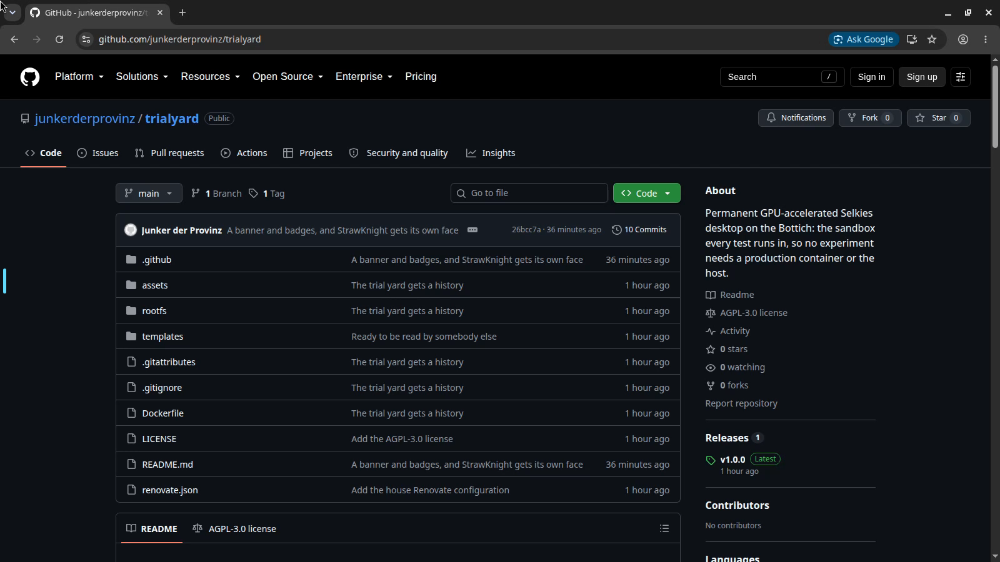

<p align="center">
  <picture>
    <source media="(prefers-color-scheme: dark)" srcset="https://raw.githubusercontent.com/junkerderprovinz/trialyard/main/.github/assets/trialyard-banner-dark.png">
    
  </picture>
</p>

<p align="center">
  <a href="https://github.com/junkerderprovinz/trialyard/actions/workflows/build.yml"></a>&nbsp;
  <a href="https://github.com/selkies-project/selkies"></a>&nbsp;
  <a href="https://www.nvidia.com"></a>&nbsp;
  <a href="templates/trialyard.xml"></a>&nbsp;
  <a href="https://github.com/junkerderprovinz/trialyard/releases/latest"></a>&nbsp;
  <a href="LICENSE"></a>
</p>

<br>

<p align="center">
  A permanent GPU-accelerated desktop that exists to be tested in, so no experiment ever needs a production container or the host.
</p>

<br>

<p align="center">
  <a href="https://github.com/junkerderprovinz/trialyard/releases/latest/download/docker-compose.yml"></a>
  &nbsp;
  <a href="https://github.com/junkerderprovinz/trialyard/archive/refs/heads/main.zip"></a>
</p>

<br>

<p align="center">
A one-knight job: I build it, keep it running, work through the issues and add what people ask for, until nothing is missing. It is free, with no accounts, no telemetry, no ads and no paid tier. No asterisk anywhere. Nothing readable ever leaves your own walls. Forged on evenings and weekends, with heart and stubbornness.
</p>

<p align="center">
If it has earned a place on your server or computer, toss a coin to your knight: it helps cover the costs and keeps the project alive. It also makes this knight's heart beat a little faster. Three ways below, whichever suits you.
</p>

<br>

<p align="center">
  <a href="https://buymeacoffee.com/junkerderprovinz"></a>
  &nbsp;
  <a href="https://paypal.me/hallelujadesign"></a>
  &nbsp;
  <a href="https://junkerderprovinz.github.io/junkerderprovinz/"></a>
</p>

<br>

## Table of Contents

1. [What it is](#1-what-it-is)
2. [Screenshots](#2-screenshots)
3. [Why it exists](#3-why-it-exists)
4. [The rule](#4-the-rule)
5. [What is inside](#5-what-is-inside)
6. [Things learned the hard way](#6-things-learned-the-hard-way)
7. [Building and running it](#7-building-and-running-it)
8. [Why this repo exists at all](#8-why-this-repo-exists-at-all)
9. [Support this project](#9-support-this-project)

<br>

## 1. What it is

A trial yard is the walled ground a smith keeps beside the forge: the place where a blade gets swung at something breakable, on purpose, before anyone carries it.

This container is a full [Selkies](https://github.com/selkies-project/selkies) desktop with a real GPU, a real Firefox and a real Google Chrome, and a working toolchain. It runs permanently on its own address on the LAN, and it is where every test that needs a browser, a screen or a graphics card is run.

<br>

## 2. Screenshots

<p align="center">
  
</p>

<p align="center">
  <sub>Chrome running on the desktop, seen through a browser tab. The desktop is the thing in the tab, and the browser inside it is real.</sub>
</p>

<br>

## 3. Why it exists

A background test agent for [selkies-project/selkies#305](https://github.com/selkies-project/selkies/pull/305) reported back that it had "no browser or GPU on my box", while two machines with GPUs sat in the same house. The gap was not hardware, it was that nothing was standing ready to be used.

So something is. A headful click, a pointer lock, a hardware decode, a screenshot: all of them need a desktop that actually draws, and none of them are worth risking a production container over.

<br>

## 4. The rule

**Every test runs here first.** No ad-hoc test containers.

Only the thing under test gets a container of its own; the client that pokes at it is always TrialYard. Ad-hoc containers duplicate the setup and quietly step around the resource and isolation limits this one was given on purpose.

<br>

## 5. What is inside

| | |
|---|---|
| Base | `ghcr.io/linuxserver/baseimage-selkies`, pinned tag |
| GPU | RTX 4070 Ti SUPER, via `--runtime=nvidia` with `compute,video,utility` |
| Browsers | Firefox and Google Chrome, both real windows on `DISPLAY=:1` |
| Toolchain | Go, Node, Python, git, a C and C++ toolchain, Playwright's OS dependencies |
| Network | `br0.20`, its own address, HTTPS WebUI on 3001, no port mapping |
| Limits | 4 CPUs and 6 GiB, a hard ceiling rather than a reservation |
| Persistence | `/config` only. `GOPATH` and the npm global prefix live there, so they survive a container rebuild |

The mount list is short on purpose: the sandbox cannot reach production data, because it was never handed a path to it.

<br>

## 6. Things learned the hard way

Each of these cost a diagnosis once. They are here so they cost nothing the second time.

**Line endings.** Everything in this repo ends up inside a Linux container. An s6 run script checked out with CRLF fails as `bad interpreter: /usr/bin/with-contenv bash^M`, the service dies instantly, s6 restarts it, and the log fills with a line naming a file that plainly exists. `.gitattributes` pins LF for exactly this reason.

**s6 oneshots need an `up` file.** Only `longrun` services get by with a bare `run`. Without the marker the first build died at `s6-rc-compile: fatal` and the container never started.

**An empty desktop is indistinguishable from a broken one.** The right-click menu was built correctly and was entirely undiscoverable. The wallpaper now says out loud that the desktop has a right-click menu, because a user cannot be expected to guess at black.

**Unraid labels come from Unraid, never from the image.** A container created by a raw `docker run` has no `net.unraid.docker.managed` label, and without it Unraid shows the container as an orphan and refuses to edit it, no matter what template file exists. Create and rebuild through the template, not by hand.

**Check that limits actually applied.** `docker inspect` once reported `CpuQuota: 0, Memory: 0` while the template said `--cpus=4 --memory=6g`. A limit written down is not a limit in force.

**Playwright starts a fresh browser profile every run.** Anything in `localStorage` is gone, which looks exactly like a bug in whatever you were testing.

**`el.click()` from `page.evaluate()` is not a trusted gesture,** so popups are blocked. Use `page.mouse.click()` on the bounding box for anything that opens a window.

**Never read GPU state from a fresh `docker exec` shell.** It does not inherit the session environment, so `glxinfo` reports `llvmpipe` and you go looking for a driver problem that is not there. Read `/proc/<session-pid>/environ` instead.

<br>

## 7. Building and running it

Pull it:

```sh
docker pull ghcr.io/junkerderprovinz/trialyard:latest
```

Or build it yourself:

```sh
docker build -t ghcr.io/junkerderprovinz/trialyard:latest .
```

The container itself is created and rebuilt through its Unraid template
([`templates/trialyard.xml`](templates/trialyard.xml)), never by a raw
`docker run`. Copy it to
`/boot/config/plugins/dockerMan/templates-user/my-TrialYard.xml` and rebuild:

```sh
php /usr/local/emhttp/plugins/dynamix.docker.manager/scripts/rebuild_container TrialYard
```

<br>

## 8. Why this repo exists at all

It did not, until 2026-09-13. The source lived as a folder on the array, with no
history and no diff, which is one careless overwrite away from being
unreconstructible. A container image built from a state nobody can reach again
cannot be inspected later, only rebuilt from scratch, and that lesson was
already paid for once elsewhere.

The folder on the server stays as the build context. This is where its history
lives.

<br>

## 9. Support this project

Problems, wishes or suggestions? You're welcome to [open an issue](https://github.com/junkerderprovinz/trialyard/issues).

A one-knight job: I build it, keep it running, work through the issues and add what people ask for, until nothing is missing. It is free, with no accounts, no telemetry, no ads and no paid tier. No asterisk anywhere. Nothing readable ever leaves your own walls. Forged on evenings and weekends, with heart and stubbornness.

If it has earned a place on your server or computer, toss a coin to your knight: it helps cover the costs and keeps the project alive. It also makes this knight's heart beat a little faster. Three ways below, whichever suits you.

<p align="center">
  <a href="https://buymeacoffee.com/junkerderprovinz"></a>
  &nbsp;
  <a href="https://paypal.me/hallelujadesign"></a>
  &nbsp;
  <a href="https://junkerderprovinz.github.io/junkerderprovinz/"></a>
</p>
