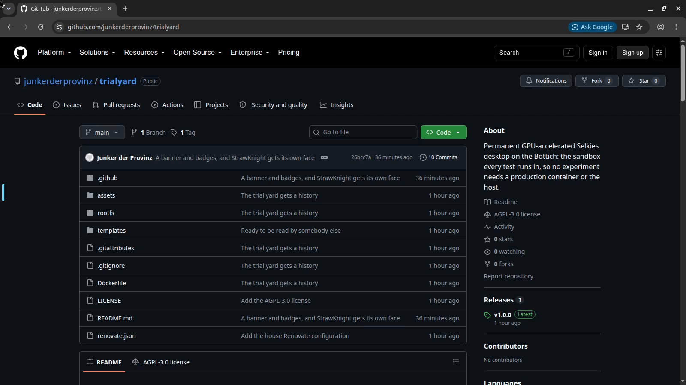

<p align="center">
  <picture>
    <source media="(prefers-color-scheme: dark)" srcset="https://raw.githubusercontent.com/junkerderprovinz/trialyard/main/.github/assets/trialyard-banner-dark.png">
    
  </picture>
</p>

<p align="center">
  <a href="https://github.com/junkerderprovinz/trialyard/actions/workflows/build.yml"></a>&nbsp;
  <a href="https://github.com/selkies-project/selkies"></a>&nbsp;
  <a href="https://www.nvidia.com"></a>&nbsp;
  <a href="templates/trialyard.xml"></a>&nbsp;
  <a href="https://github.com/junkerderprovinz/trialyard/releases/latest"></a>&nbsp;
  <a href="LICENSE"></a>
</p>

<br>

<p align="center">
  A permanent GPU-accelerated desktop that exists to be tested in, so no experiment ever needs a production container or the host.
</p>

<br>

<!-- download-buttons: written by scripts/gen_download_buttons.py -->
<p align="center">
  <a href="https://github.com/junkerderprovinz/trialyard/releases/latest/download/docker-compose.yml"></a>
  &nbsp;
  <a href="https://github.com/junkerderprovinz/trialyard/archive/refs/heads/main.zip"></a>
  <br><sub>Always downloads the latest build</sub>
</p>
<!-- /download-buttons -->

<br>

<p align="center">
A one-knight job: I build it, keep it running, work through the issues and add what people ask for, until nothing is missing. It is free, with no accounts, no telemetry, no ads and no paid tier. No asterisk anywhere. Nothing readable ever leaves your own walls. Forged on evenings and weekends, with heart and stubbornness.
</p>

<p align="center">
If it has earned a place on your server or computer, toss a coin to your knight: it helps cover the costs and keeps the project alive. It also makes this knight's heart beat a little faster. Three ways below, whichever suits you.
</p>

<br>

<!-- give-buttons: written by scripts/gen_download_buttons.py -->
<p align="center">
  <a href="https://buymeacoffee.com/junkerderprovinz"></a>
  &nbsp;
  <a href="https://www.paypal.com/donate/?hosted_button_id=76FVV52TKXTUS"></a>
  &nbsp;
  <a href="https://junkerderprovinz.github.io/junkerderprovinz/"></a>
</p>
<!-- /give-buttons -->

<br>

## Table of Contents

1. [What it looks like](#1-what-it-looks-like)
2. [What it does](#2-what-it-does)
3. [Getting started](#3-getting-started)
4. [How AI is used here](#4-how-ai-is-used-here)
5. [Support this project](#5-support-this-project)

<br>

## 1. What it looks like

<p align="center">
  
</p>

<p align="center">
  <sub>Chrome running on the desktop, seen through a browser tab. The desktop is the thing in the tab, and the browser inside it is real.</sub>
</p>

<br>

## 2. What it does

A trial yard is the walled ground a smith keeps beside the forge: the place where a blade gets swung at something breakable, on purpose, before anyone carries it.

- **A desktop that really draws.** A [Selkies](https://github.com/selkies-project/selkies) desktop in a browser tab, with a real Firefox and a real Google Chrome on it. Headful clicks, pointer lock and screenshots all work.
- **A GPU and a toolchain.** An NVIDIA card through the nvidia runtime, plus Go, Node, Python, git, a C and C++ toolchain and Playwright's system dependencies.
- **Always there.** It runs permanently on its own address on the LAN. Every test that needs a browser, a screen or a graphics card runs here, and only the thing under test gets a container of its own.
- **Fenced in.** 4 CPUs and 6 GiB as a hard ceiling, and `/config` as its only mount, so it has no path to production data. `GOPATH` and the npm global prefix live in `/config` and survive a rebuild.

<br>

## 3. Getting started

The compose button at the top downloads a ready file. Start it with:

```sh
docker compose up -d
```

Then open `https://<this-host>:3001/` and accept the self-signed certificate once. Right-click the desktop for a terminal, Firefox or Google Chrome. Without an NVIDIA card, drop the `runtime` line and the two `NVIDIA_` variables from the file, and the desktop draws in software.

On Unraid, create and rebuild the container through its template, [`templates/trialyard.xml`](templates/trialyard.xml), and never by a raw `docker run`. Unraid only manages a container it created itself; anything else shows up as an orphan it refuses to edit. Copy the template to `/boot/config/plugins/dockerMan/templates-user/my-TrialYard.xml` and rebuild:

```sh
php /usr/local/emhttp/plugins/dynamix.docker.manager/scripts/rebuild_container TrialYard
```

The image is `ghcr.io/junkerderprovinz/trialyard:latest`. To build it yourself:

```sh
docker build -t ghcr.io/junkerderprovinz/trialyard:latest .
```

<br>

## 4. How AI is used here

One knight builds this, and AI is one of the tools I work with, the same way I work with an editor or a compiler. It helps me write code and documentation and it checks my work, and that saves me a good many evenings. It does not make the decisions, though. I read and understand everything before it ships, and if something here breaks, that is on me and not on the tool.

You do not have to take my word for it. The code is open and every release note is written by hand. The issue tracker shows how problems actually get handled, including the ones I got wrong the first time. If you find something that is not right, open an issue and I will look at it.

<br>

## 5. Support this project

Problems, wishes or suggestions? You're welcome to [open an issue](https://github.com/junkerderprovinz/trialyard/issues).

A one-knight job: I build it, keep it running, work through the issues and add what people ask for, until nothing is missing. It is free, with no accounts, no telemetry, no ads and no paid tier. No asterisk anywhere. Nothing readable ever leaves your own walls. Forged on evenings and weekends, with heart and stubbornness.

If it has earned a place on your server or computer, toss a coin to your knight: it helps cover the costs and keeps the project alive. It also makes this knight's heart beat a little faster. Three ways below, whichever suits you.

<!-- give-buttons: written by scripts/gen_download_buttons.py -->
<p align="center">
  <a href="https://buymeacoffee.com/junkerderprovinz"></a>
  &nbsp;
  <a href="https://www.paypal.com/donate/?hosted_button_id=76FVV52TKXTUS"></a>
  &nbsp;
  <a href="https://junkerderprovinz.github.io/junkerderprovinz/"></a>
</p>
<!-- /give-buttons -->
